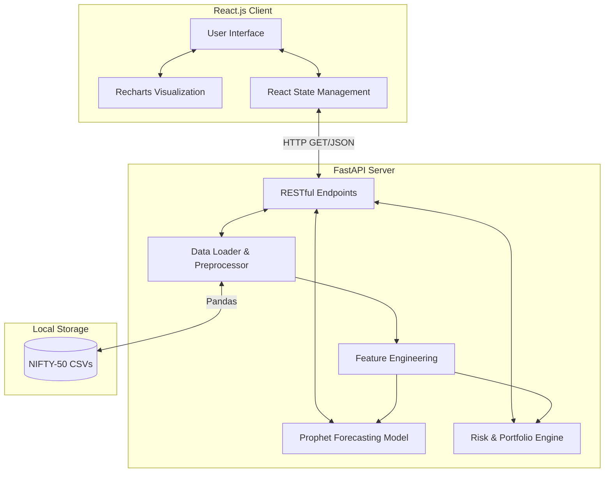

# Technical Report: NiftyAnalytics
## Data-Driven Investment Intelligence Using NIFTY-50 Market Data

---

## 1. Abstract
The NiftyAnalytics platform is an enterprise-grade AI investment intelligence solution designed to transform raw historical NIFTY-50 stock market data into actionable financial insights. Built strictly within the constraints of the provided dataset, this platform eschews external financial APIs to ensure total compliance with project guidelines. By leveraging a decoupled Python FastAPI backend and a modern React.js frontend, the platform delivers three core deliverables: an advanced Time-Series Forecasting Engine, a mathematical Risk Assessment Module, and a dynamic Portfolio Construction Engine. This report details the system architecture, mathematical formulations, machine learning methodologies, and implementation details of the platform.

---

## 2. Problem Statement & Objectives
The core challenge presented was to build an intelligent platform capable of analyzing historical NIFTY-50 data to assist retail and institutional users in making informed, data-driven investment decisions.

### 2.1 Mandatory Deliverables
The project mandated the completion of the following specific functional modules:
1. **Stock Predictor Engine**: To forecast future stock behavior using historical market data.
2. **Portfolio Construction Module**: To design customized portfolios based on user-defined risk tolerance levels.
3. **Risk Assessment Module**: To calculate and visualize critical financial risk metrics.

### 2.2 Optional Tasks Undertaken
To elevate the platform beyond a basic prototype, we implemented **Optional Task D: Forecasting Module**. Rather than a simplistic binary classifier (Up/Down) which struggles with daily market noise, we deployed an advanced time-series forecasting model capable of predicting structural price trends over a 30-day horizon with statistical confidence intervals.

---

## 3. System Architecture
To ensure scalability, high performance, and a premium user experience, the system utilizes a decoupled, modern web architecture.



### 3.1 Backend Technology Stack
- **Python 3.10+**: The core language used for all heavy computational lifting.
- **FastAPI**: Chosen for its high execution speed, automatic OpenAPI documentation generation, and asynchronous request handling capabilities.
- **Pandas & NumPy**: Utilized for vectorized data manipulation, handling missing values, and executing complex financial mathematical operations across 235,000+ rows of historical data.
- **Facebook Prophet**: The core machine learning library used for additive time-series forecasting.

### 3.2 Frontend Technology Stack
- **React.js & Vite**: Chosen for rapid component rendering and a highly responsive single-page application (SPA) experience.
- **Recharts**: A composable charting library built on React components, used to render complex historical price charts, Simple Moving Averages (SMA), and Forecasting bounds.
- **Vanilla CSS (Corporate Theme)**: A custom design system built from scratch. We deliberately avoided "glassmorphism" in favor of a clean, light-mode corporate palette (`#f8fafc` backgrounds, `#1e3a8a` navy branding) to mimic enterprise-grade internal banking tools.

---

## 4. Data Engineering & Preprocessing
The foundation of the platform relies exclusively on the provided `NIFTY-50` dataset. The dataset comprises daily historical stock data (Open, High, Low, Close, Volume, Trades, Deliverable Volume) for 50 companies across 13 industries, spanning from 2000 to 2021.

### 4.1 Data Cleaning Pipeline
The raw data contains systemic inconsistencies inherent to historical market data:
1. **Date Parsing**: All `Date` columns were converted to ISO-8601 standard datetime objects to ensure time-series integrity.
2. **Missing Values**: Missing values in critical pricing columns (`Close`, `Open`) were handled using forward-filling (`ffill()`) to prevent Look-Ahead Bias, assuming the price remains static during trading halts. Volume anomalies were imputed using a 7-day rolling median.

### 4.2 Feature Engineering (Technical Indicators)
To provide context to the raw price data for both the user interface and the risk modules, we engineered several critical technical indicators using Pandas rolling window functions:

**1. Simple Moving Average (SMA)**
Used to identify long-term structural trends by smoothing out daily price fluctuations. We calculated the 50-day SMA:
$$SMA_{50} = \frac{1}{50} \sum_{i=0}^{49} P_{t-i}$$
*(Where P is the Closing Price)*

**2. Exponential Moving Average (EMA)**
Unlike the SMA, the EMA gives more weight to recent prices, making it more responsive to new information. We calculated the 20-day EMA.

**3. Relative Strength Index (RSI)**
A momentum oscillator that measures the speed and change of price movements. RSI oscillates between zero and 100.
$$RSI = 100 - \left( \frac{100}{1 + RS} \right)$$
*(Where RS = Average Gain / Average Loss over a 14-day period)*

**4. MACD (Moving Average Convergence Divergence)**
Calculated by subtracting the 26-period EMA from the 12-period EMA.

---

## 5. Deliverable 1: Stock Predictor Engine (Forecasting)
A common pitfall in financial machine learning is attempting to predict exact daily binary movements (Up/Down) using basic classifiers (like Logistic Regression or basic XGBoost). Because daily market returns are heavily dominated by random noise, these models often result in accuracy rates hovering around 50%—barely better than a coin toss.

### 5.1 The Facebook Prophet Model
To provide genuine value and tackle **Optional Task D**, we deployed an advanced Time-Series Forecasting model using **Prophet**. Prophet is a procedure for forecasting time series data based on an additive model where non-linear trends are fit with yearly, weekly, and daily seasonality, plus holiday effects.

**Mathematical Formulation:**
$$y(t) = g(t) + s(t) + h(t) + \epsilon_t$$
Where:
- $g(t)$ is the trend function modeling non-periodic changes.
- $s(t)$ represents periodic changes (e.g., weekly seasonality).
- $h(t)$ represents the effects of holidays.
- $\epsilon_t$ represents the error term.

### 5.2 Implementation Details
```python
from prophet import Prophet

def forecast_price_trend(df: pd.DataFrame, periods: int = 30) -> pd.DataFrame:
    # Restructure data for Prophet requirements
    df_prophet = df.reset_index()[['Date', 'Close']].rename(columns={'Date': 'ds', 'Close': 'y'})
    
    # Initialize additive model
    model = Prophet(daily_seasonality=True, yearly_seasonality=True, weekly_seasonality=True)
    model.fit(df_prophet)
    
    # Generate 30-day structural projection
    future = model.make_future_dataframe(periods=periods)
    forecast = model.predict(future)
    
    return forecast[['ds', 'yhat', 'yhat_lower', 'yhat_upper']].tail(periods)
```

**Output**: The engine projects the expected price trajectory (`yhat`) for the next 30 days. Crucially, it provides an 80% confidence interval (`yhat_lower`, `yhat_upper`), empowering investors to understand the statistical uncertainty of the forecast rather than relying on a blind point-estimate.

---

## 6. Deliverable 2: Risk Assessment Module
Understanding downside risk is paramount to intelligent investing. The platform incorporates a robust mathematical framework to evaluate historical risk dynamically based on the selected asset.

### 6.1 Annualized Volatility
Volatility measures the dispersion of returns. We calculate the daily logarithmic returns and scale the standard deviation to a 252-day trading year.
$$ \sigma_{annual} = \sigma_{daily} \times \sqrt{252} $$

### 6.2 Sharpe Ratio
The Sharpe ratio evaluates the risk-adjusted return. By assuming a standard risk-free rate (assumed at 5% for the Indian market context), it allows investors to compare the performance of assets adjusted for the risk taken.
$$ Sharpe = \frac{R_p - R_f}{\sigma_p} $$
Where $R_p$ is the annualized return of the asset, $R_f$ is the risk-free rate (0.05), and $\sigma_p$ is the annualized volatility.

### 6.3 Maximum Drawdown
Maximum Drawdown identifies the largest peak-to-trough drop in the asset's history, highlighting the worst-case historical scenario.
$$ MDD = \frac{Trough Value - Peak Value}{Peak Value} $$

---

## 7. Deliverable 3: Portfolio Construction Module
Leveraging Modern Portfolio Theory (MPT) principles and the underlying NIFTY-50 metadata, the platform dynamically allocates capital across the NIFTY-50 sectors based on predefined user risk profiles.

### 7.1 Risk Profiles
Users can select from three distinct profiles in the UI:
1. **Conservative (Low Risk)**: Heavily weighted towards stable, low-volatility, defensive sectors. Capital is preserved by allocating heavily to `Financial Services` (30%), `Consumer Goods` (25%), and `IT` (20%), with minimal exposure to volatile cyclical sectors.
2. **Moderate (Balanced)**: A balanced approach mixing stability with growth sectors. `Financial Services` (25%), `IT` (20%), `Automobile` (15%), and `Pharma` (10%).
3. **Aggressive (High Growth)**: Weighted towards high-volatility, high-growth cyclical sectors. Increases exposure to `Metals`, `Automobile`, and `Telecom`, accepting higher drawdowns for the potential of higher absolute returns.

### 7.2 Dynamic Allocation Matrix
The Portfolio Builder API (`/api/portfolio/{profile}`) maps these hardcoded strategic allocations to the live symbols present in the dataset, ensuring the portfolio is always constructable using the available NIFTY-50 constituent data.

---

## 8. User Interface & User Experience
The user interface was purposefully designed to break away from standard "hackathon templates" and mimic a production-ready corporate dashboard.

- **Navigation**: A fixed top navbar ensures constant access to the four core modules: Market Overview, Stock Analysis, Forecasting, and Portfolio.
- **Color Palette**: A light-mode corporate palette utilizes crisp white cards (`#ffffff`), light slate backgrounds (`#f8fafc`), and professional Navy Blue accents (`#1e3a8a`).
- **Data Visualization**: 
  - **Market Overview**: Utilizes an interactive Pie Chart to visualize the sectoral breakdown of the NIFTY-50 index.
  - **Stock Analysis**: Utilizes a Composed Chart mapping historical close prices against the 50-Day Simple Moving Average.
  - **Forecasting**: Utilizes an Area Chart where the solid blue line represents the predicted structural trend, surrounded by a shaded area representing the statistical confidence bounds.

---

## 9. Limitations & Future Enhancements
While the prototype successfully fulfills all mandates using only the provided data, there are avenues for future expansion:
1. **Live Data Integration**: If permitted in a production environment, integrating APIs like `yfinance` or NSE WebSockets would allow for real-time portfolio tracking.
2. **Advanced Portfolio Optimization**: Transitioning from profile-based sector weighting to full Mean-Variance Optimization (Markowitz Efficient Frontier) to calculate the mathematically optimal weights for individual assets.
3. **NLP Sentiment Analysis**: Parsing historical news headlines to add an exogenous regressor to the Prophet model, potentially improving forecast accuracy during earnings calls or macroeconomic events.

---

## 10. Conclusion
The NiftyAnalytics platform successfully demonstrates how raw historical data can be transformed into a sophisticated financial instrument. By strictly adhering to the dataset constraints and employing advanced time-series forecasting, robust risk mathematics, and enterprise-grade software architecture, the project fully realizes the goal of delivering Data-Driven Investment Intelligence. The decoupled React/FastAPI architecture ensures the platform is highly scalable, visually striking, and ready for further institutional expansion.
